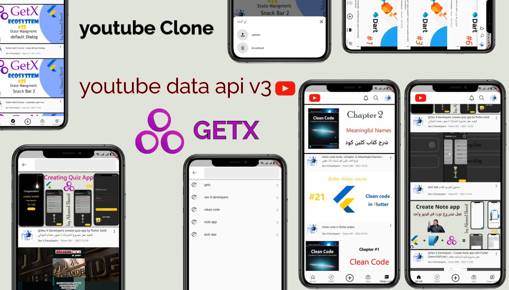
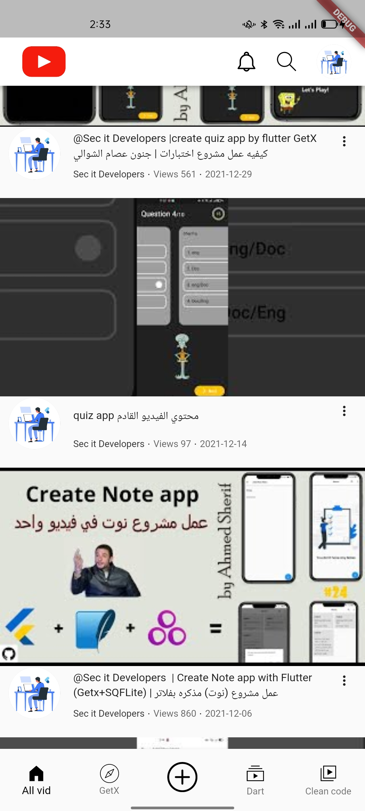
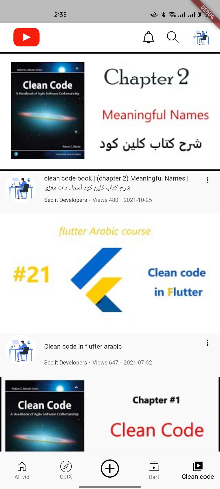
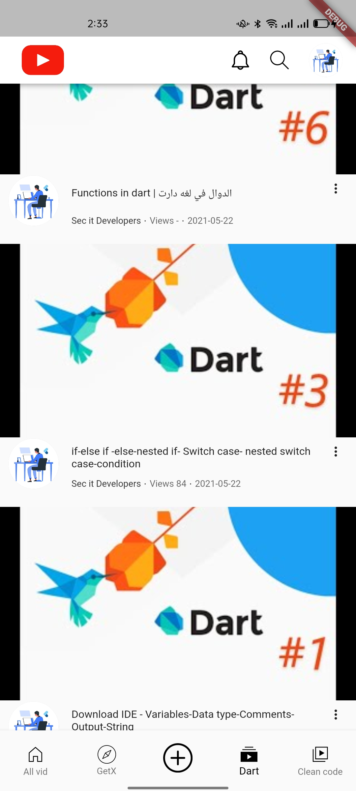
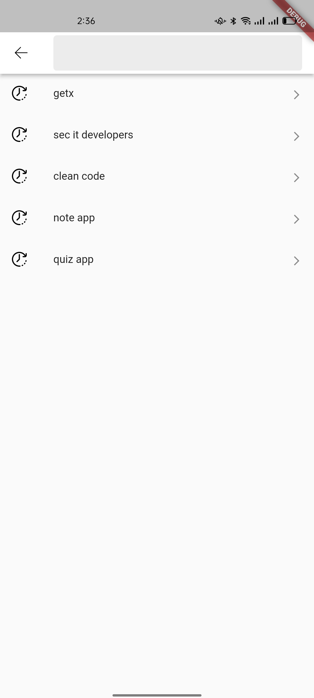
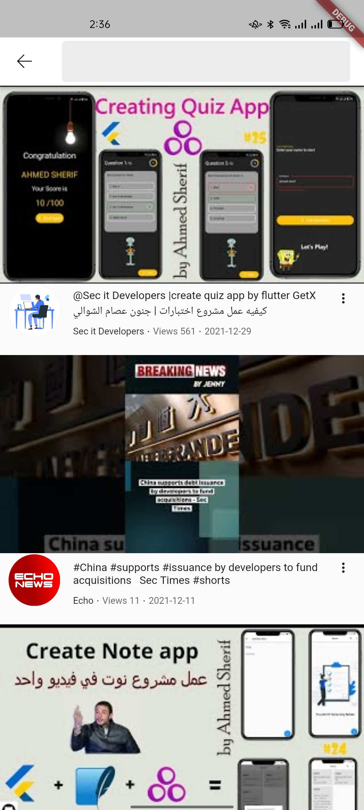
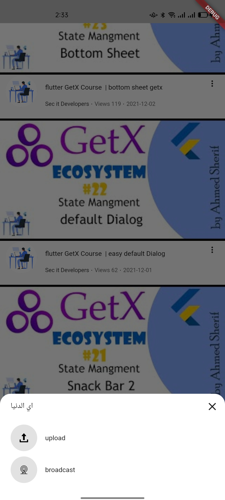
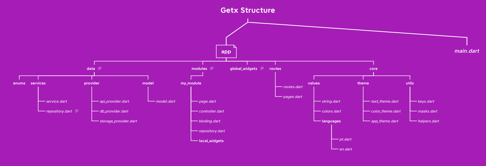

# Youtube App ✍🏻
Youtube App Clone with GetX & Youtube Data Api V3 [MVC pattern] 👨🏻‍💻

Youtube App app is open-source Youtube App app for Android & ios. It is built with Dart on top of Google's Flutter Framework.

<b>Youtube App</b>

## About🤠

Youtube Clone App By Flutter With GetX EcoSystem And Youtube Data Api V3

## Snapshots

| Home Page | Clean code Page|
|------|-------|
|||

| GetX Page | Dart Page|
|------|-------|
|||

| Search Page | Screen Search |
|------|-------|
|||

| Bottom Bar
|------
|

## Other Flutter Projects 🔐
- [Quiz App](https://github.com/itsherifAhmed/Quiz-app)
- [News App](https://github.com/itsherifAhmed/NewsApp)
- [Device Detail App](https://github.com/itsherifAhmed/device-detail-app)
- [White board Draw App](https://github.com/itsherifAhmed/draw-app)
- [music app player external storage read](https://github.com/itsherifAhmed/Music-Player-Read-external-Storage-Flutter-app)
- [Make Up App flutter MVC Getx](https://github.com/itsherifAhmed/MakeUp-App)
- [Speech to Text app flutter](https://github.com/itsherifAhmed/Speech-to-text-app)
- [api flutter project](https://github.com/itsherifAhmed/apiFlutter-Project)
- [qr code app](https://github.com/itsherifAhmed/qr-barcode)
- [facebook ui clone](https://github.com/itsherifAhmed/facebook-ui-clone)
- [Login Screen](https://github.com/itsherifAhmed/login-screen)

 
<b>minSdkVersion 19</b>

 
<b>targetSdkVersion 28</b>

 

## Dependencies 💤
 -  `get:`
 -  
 -  `flutter_svg:`
 -  
 -  `youtube_player_flutter:`
 -  
 -  `intl:`
 -  
 -  `shared_preferences:`
 -  
 -  `cached_network_image:`

